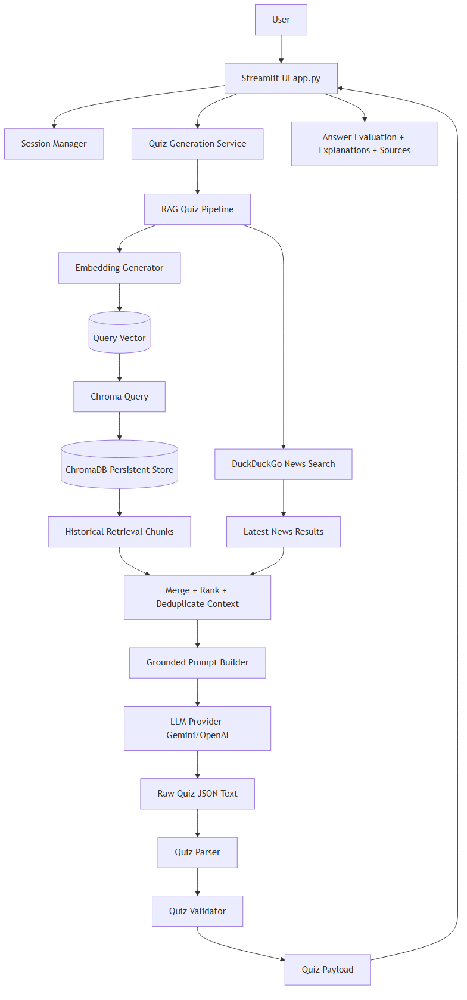

# AI Powered Sports Quiz Generation Agent

Production-style RAG application that generates fact-grounded sports quizzes using:
- Python
- Streamlit
- ChromaDB (persistent vector DB)
- DuckDuckGo Search
- Google Gemini API or OpenAI API
- sentence-transformers

## Architecture

### Frontend
- `app.py` (Streamlit)
- Sidebar controls (sport, difficulty, generate, reset)
- Interactive quiz cards, scoring, explanations, source context, history

### Backend / Services
- `services/data_loader.py`: loads and validates historical facts
- `services/embedding_generator.py`: sentence-transformer embeddings
- `database/chroma_store.py`: ChromaDB upsert/query/filter
- `services/news_search.py`: DuckDuckGo latest sports news
- `services/gemini_client.py`: LLM generation adapter (Gemini/OpenAI)
- `services/quiz_parser.py`: strict quiz JSON parsing

### Orchestration
- `core/vector_indexer.py`: incremental indexing pipeline
- `core/rag_quiz_pipeline.py`: historical + news retrieval, ranking, prompt flow
- `core/quiz_generation_service.py`: generate + parse + validate
- `core/quiz_validator.py`: business validation
- `core/session_manager.py`: quiz session lifecycle

### Prompt Flow
1. Retrieve historical context from ChromaDB
2. Retrieve latest news from DuckDuckGo
3. Merge/rank/dedupe context
4. Build anti-hallucination grounded prompt
5. Selected LLM provider (Gemini/OpenAI) returns JSON quiz (or `Insufficient context.`)
6. Parse + validate + render in Streamlit

## Data Flow (High Level)
`Historical JSON -> Embeddings -> ChromaDB -> Retrieval + News -> Prompt -> Gemini -> Parser/Validator -> UI`

## Project Structure
```text
sports_quiz_agent/
├── app.py
├── requirements.txt
├── .env.example
├── .gitignore
├── README.md
├── .streamlit/
│   └── config.toml
├── config/
├── core/
├── services/
├── database/
├── prompts/
├── models/
├── utils/
├── tests/
├── assets/
├── logs/
├── data/
└── vector_db/
```

## Setup
```powershell
python -m venv .venv
.\.venv\Scripts\Activate.ps1
pip install -r requirements.txt
```

Create `.env` from `.env.example` and set:
- `LLM_PROVIDER` = `gemini` or `openai`
- If `gemini`: `GEMINI_API_KEY`
- If `openai`: `OPENAI_API_KEY`

## Run
```powershell
streamlit run app.py
```

## Tests
```powershell
pytest -q
```

## Architecture Artifacts
- Data Flow Diagram: `assets/diagrams/data-flow.mmd`
- Class Diagram: `assets/diagrams/class-diagram.mmd`
- Sequence Diagram: `assets/diagrams/sequence-diagram.mmd`

### Rendered Diagrams
#### Data Flow Diagram


## Future Improvements
- Add retries/backoff around all external providers
- Add semantic reranking model for retrieval
- Add user auth and persisted user quiz history
- Add telemetry dashboards for generation quality
